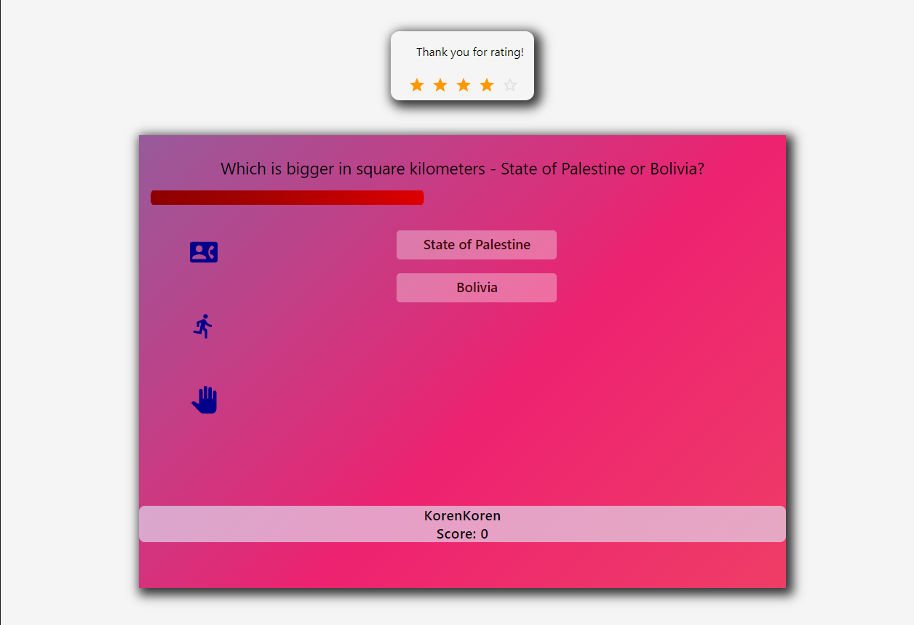
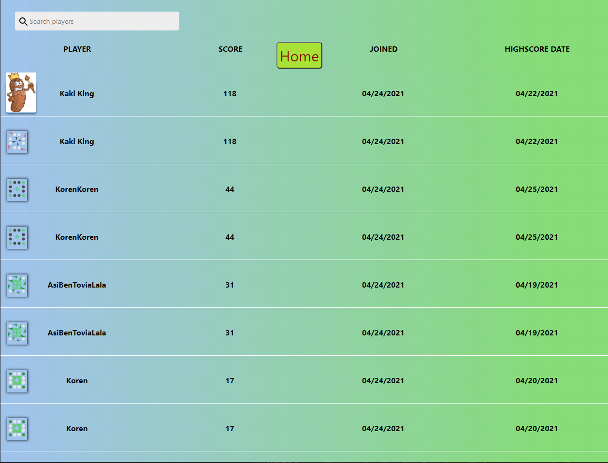

# Quizzer
## A self-learning world-trivia app that focuses on user reputation to calculate question scores and probability of various scenarios.

 
# Introduction

This is a World Trivia or quiz app built with React.js, nodejs and Sequelize mySQL. 

# Gameplay:

# Motivation

The idea was to create somewhat of a self-learning mechanism for the app:

* Collects various information about the users: scores, playtime, success rates in game, overall effort..
* Lets users rate questions.
* Ratings from users are weighed differently depending on their reputation and overall scorings, and rated questions get saved to the database.
* Saved questions are served to clients during gameplay (instead of randomly generated questions from templates) based on chance that is correlated to their final scores, as well as the total amount of quesitons that are stored in the database.

# The math basics

User-ratings weigh according to the following formula:

> Score = [(Player A question rating) * (Player A final score) +... + (Player Y question rating) (Player X final score)] / [(Player A final score) + ... + (Player Y final score)]

Saved questions' chance to appear is resembled by the following:

> Question chance = Question rating / All questions ratings combined

# Difficulty

The game includes three difficulty levels, each level with it's own extra bit of challenge. The points users get when answering (both right or wrong answers) are determined by the difficulty level.

# Leaderboards

The game has a leaderboards page that displays all players' highscores, dates and a few more informatics:

## Contributing
Pull requests are welcome. For major changes, please open an issue first to discuss what you would like to change.
Please make sure to update tests as appropriate.

## Current Contributors and credits

Koren BE

## License
Korenisimo, 2021

